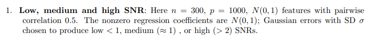
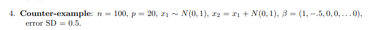
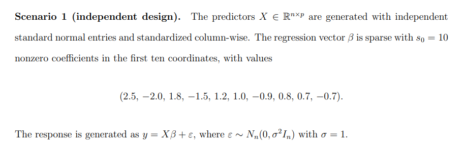

## Project Structure

```text
scenarios/
├── README.md
├── scenario1.m
├── scenario2.m
├── supp_funs/
│   ├── compute_sparse_metrics.m
│   ├── generate_scenario1_data.m
│   ├── generate_scenario2_data.m
│   ├── save_scenario_csv.m
│   └── summarize_unisparse_methods.m
└── output/
```

# scenario output
3 methods × 3 SNR levels 

# output file:
output/Output_scenario_<>_methodname_<>_n_<>_p<>_design_<>_SNR_<>_rho_<>_rep<>.csv

# Scenario 1:


# Scenario 2:


# Scenario 3:
